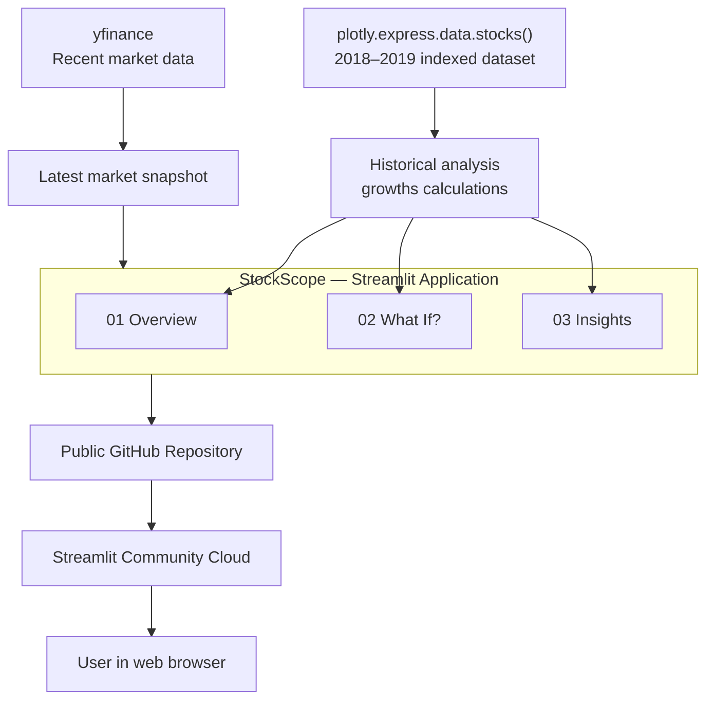
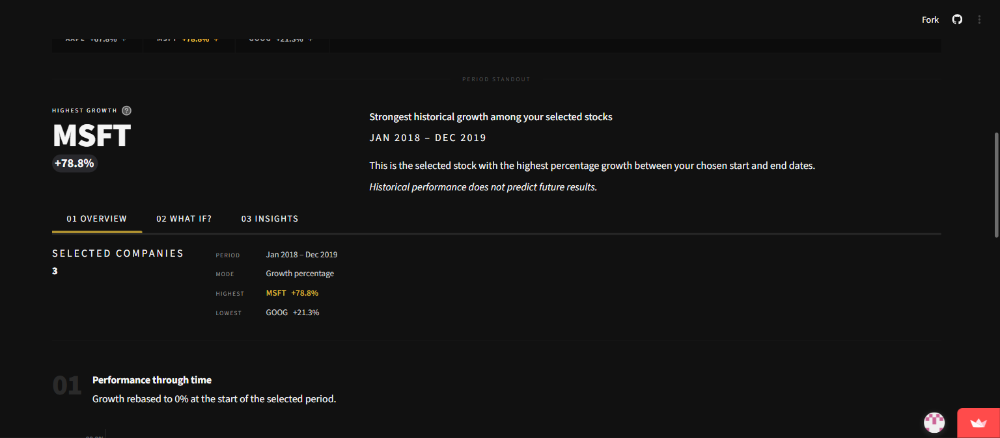

# StockScope

**Compare. Understand. Invest smarter.**

StockScope is a beginner-friendly Streamlit application for exploring and comparing the historical performance of six major technology companies. It combines interactive data visualisation, a hypothetical investment calculator, plain-language insights, and a separate real-world market snapshot — all in a single, clean interface.

**Live app:** [stockscope-fwwhj7hbjgnkpky4zgmmrs.streamlit.app](https://stockscope-fwwhj7hbjgnkpky4zgmmrs.streamlit.app/)  
**Repository:** [github.com/KlimentinaChapovska/stockscope](https://github.com/KlimentinaChapovska/stockscope)

---

## Project overview

StockScope was built as a take-home assignment using Claude Code and a set of MCP (Model Context Protocol) servers. The goal was to produce a portfolio-quality fintech dashboard that helps non-expert users understand what historical stock performance data actually means.

The application lets you:

- Compare up to six Big Tech companies across any slice of the 2018–2019 historical dataset
- Explore growth percentage and indexed performance side by side
- Test hypothetical investment scenarios — what would $1,000 have grown to?
- Read three automatically generated plain-language observations about the selected period
- Check the most recent available closing prices in a clearly labelled, separate section

---

## Features

- **Interactive comparison controls** — select any combination of AAPL, AMZN, FB/META, GOOG, MSFT, and NFLX
- **Custom date range** — filter the historical dataset to any start and end date within 2018–2019
- **Two display modes** — Growth percentage or Indexed performance, toggled with a radio selector
- **Big Tech Race chart** — horizontal bar chart ranking selected companies by growth for the chosen period
- **Market pulse strip** — inline ticker strip below the race chart showing each company's growth at a glance
- **Best performer block** — headline metric highlighting the top stock, average growth, and performance spread
- **01 Overview tab** — editorial summary (company count, period, highest, lowest) and a historical line chart
- **02 What If? calculator** — three modes: One stock, Compare all companies, Split equally across a portfolio
- **03 Insights tab** — three dynamic observations, monthly return heatmap showing strong and weak periods for selected stocks, plus a verified company fact
- **Separate latest-market snapshot** — recent closing price, daily change, and date per ticker via yfinance; clearly marked as distinct from the historical series
- **Responsive dark interface** — charcoal-and-gold editorial design that adapts to narrower screens
- **Graceful onboarding** — styled prompt shown before any stock is selected; per-ticker failure handling in the market snapshot

---

## How to use StockScope

1. Choose one or more companies from the **Build your comparison** panel.
2. Set a **start date** and **end date** within the available 2018–2019 range.
3. Select **Growth %** to see percentage change, or **Indexed** to see performance relative to the starting value.
4. The **race chart** and **market pulse strip** update immediately.
5. Open **01 Overview** for a summary and historical line chart.
6. Open **02 What If?** to enter an investment amount and explore a hypothetical scenario.
7. Open **03 Insights** to read observations about the selected period.
8. Scroll down to the **Recent Market Snapshot** for the latest available closing prices.

---

## Data sources

StockScope uses two completely separate data sources. They are not joined or mixed at any point.

### Plotly historical dataset

Loaded via `plotly.express.data.stocks()`. This dataset covers the period from January 2018 to January 2019 and contains **relative indexed-performance values**, not actual historical share prices in dollars. A value of 1.0 represents the starting price for each company; values above or below 1.0 show relative change from that baseline.

This dataset powers the race chart, the market pulse strip, the best performer metric, the Overview line chart, the What If? calculator, and the Insights observations.

### yfinance market snapshot

Used only for the **Recent Market Snapshot** section at the bottom of the page. This section shows each ticker's most recent available closing price, the daily change in dollars and percentage, and the date of that close. Data is fetched via `yfinance` and cached for 30 minutes.

This data is entirely separate from the 2018–2019 Plotly series. It reflects recent market activity and may be delayed. It is not described as real-time and is not used in any historical calculation.

> **Note:** The Plotly dataset uses the ticker `FB`. yfinance maps this to `META` automatically, since Meta Platforms (formerly Facebook) completed its rename in 2022.

---

## Architecture



---

## Technology stack

| Layer | Technology |
|---|---|
| Application framework | [Streamlit](https://streamlit.io) 1.58 |
| Data manipulation | [pandas](https://pandas.pydata.org) |
| Historical dataset | [Plotly](https://plotly.com/python/) — `plotly.express.data.stocks()` |
| Charts | Plotly Express + Plotly Graph Objects |
| Market data | [yfinance](https://github.com/ranaroussi/yfinance) |
| Language | Python 3.13 |
| Version control | Git + GitHub |
| Deployment | Streamlit Community Cloud |

---

## MCP tools used

This project was built with Claude Code and the following MCP (Model Context Protocol) servers:

| Tool | Role |
|---|---|
| **Filesystem** | Inspected and managed all project files during development |
| **Context7** | Looked up current Streamlit API documentation (`st.metric`, `st.form`, `st.session_state`) |
| **Fetch** | Retrieved and verified the company fact used in the Insights tab from an official source |
| **GitHub** | Published and manages the public repository |
| **Mermaid** | Generated and validated the architecture diagram above |
| **Playwright** | Tested the deployed application end-to-end and captured the live proof screenshot |

---

## Local setup

### 1. Clone the repository

```bash
git clone https://github.com/KlimentinaChapovska/stockscope.git
cd stockscope
```

### 2. Create a virtual environment

```powershell
python -m venv .venv
```

### 3. Install dependencies

```powershell
.\.venv\Scripts\python.exe -m pip install -r requirements.txt
```

### 4. Run the application

```powershell
.\.venv\Scripts\python.exe -m streamlit run app.py
```

The app will open at `http://localhost:8501`.

---

## Project structure

```text
stockscope/
├── app.py
├── requirements.txt
├── .gitignore
├── README.md
└── .streamlit/
    └── config.toml
```

The `assets/` folder contains the Playwright proof screenshot captured from the live deployed application.

---

## Live application

[Open StockScope](https://stockscope-fwwhj7hbjgnkpky4zgmmrs.streamlit.app/)



---

## Deployment

StockScope is deployed on Streamlit Community Cloud:

- Public GitHub repository: [KlimentinaChapovska/stockscope](https://github.com/KlimentinaChapovska/stockscope)
- `main` branch
- `app.py` as the entry point
- `requirements.txt` for dependency installation

---

## Limitations

- The Plotly historical dataset covers **January 2018 to January 2019 only**. No other periods are available.
- Values in the dataset are **indexed relative performance figures**, not actual share prices in any currency.
- The yfinance market snapshot **may be delayed** or temporarily unavailable for individual tickers. The application handles missing tickers gracefully.
- The What If? calculator **does not account for** brokerage fees, capital gains tax, dividends, currency conversion, or inflation.
- Historical growth figures shown in the calculator and Insights sections are **not predictions** of future performance.

---

## Disclaimer

StockScope is an educational project and does not provide financial advice.

---

## Source note

The company fact displayed in the Insights tab was verified on 28 June 2026 using the Fetch MCP tool.

| Field | Detail |
|---|---|
| Company | Google |
| Fact | Google's very first web server — built by Larry Page and Sergey Brin while they were students at Stanford — was assembled from Lego bricks to hold the hard drives together. |
| Source | [Our Story — Google](https://about.google/our-story/) |
